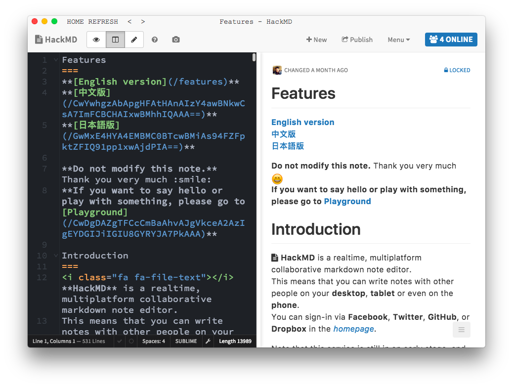

# HackMD Desktop

[](https://travis-ci.org/hackmdio/hackmd-desktop)

An electron wrapped desktop client for HackMD :tada:

[Download Here](https://github.com/hackmdio/hackmd-desktop/releases)



## Tools

- electron

## Development

```bash
npm install -g yarn
yarn

npm run dev # if you've started HackMD in localhost:3000
npm run start # load https://hackmd.io
```
